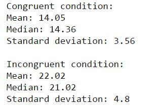
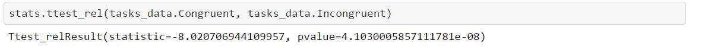
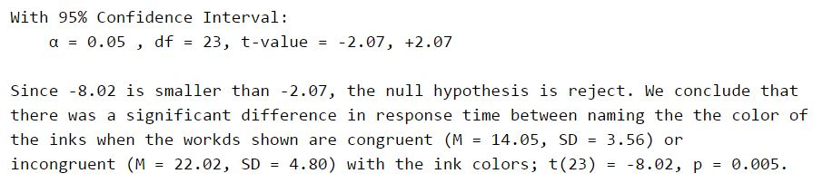

## Test a Perceptual Phenomenon
Language: Python(pandas, NumPy, Matplotlib, SciPy)  
Skills: Hypothesis testing, Measures of variability, Data visualization  
Analyzed the Stroop effect using descriptive statistics to provide an intuition about the data, 
and a two-tailed dependent sample t-test to draw a conclusion.

 

  

 

  

 

  

